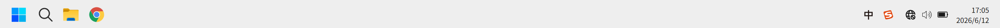

# mocktaskbar





## 日常开发流程

平时开发：

```
git add .
git commit -m "feat: 增加开始菜单"
git push
```

触发：

```
build.yml
```

结果：

```
GitHub
 └─ Actions
     └─ Build Windows
         └─ Artifacts
```

可以下载测试版。

------

## 正式发布流程

例如准备发 v1.0.0：

### 1 修改 package.json

文件：

```
{
  "version": "1.0.0"
}
```

改成：

```
{
  "version": "1.0.1"
}
```

------

### 2 提交代码

项目根目录：

```
git add .
git commit -m "release: v1.0.1"
git push
```

------

### 3 创建 Tag

项目根目录：

```
git tag v1.0.1
```

查看：

```
git tag
```

输出：

```
v1.0.0
v1.0.1
```

------

### 4 推送 Tag

项目根目录：

```
git push origin v1.0.1
```

或者：

```
git push --tags
```

------

### 5 GitHub 自动执行

触发：

```
release.yml
```

执行：

```
npm ci
↓
npm run build:win
↓
生成 exe
↓
创建 Release
↓
上传 exe
```

------

### 6 下载

GitHub 页面：

```
Code
Issues
Pull Requests
Actions
Releases
```

进入：

```
Releases
 └─ v1.0.1
      └─ MockTaskbar Setup 1.0.1.exe
```

直接下载。


## 待补充功能

1. 退出应用
